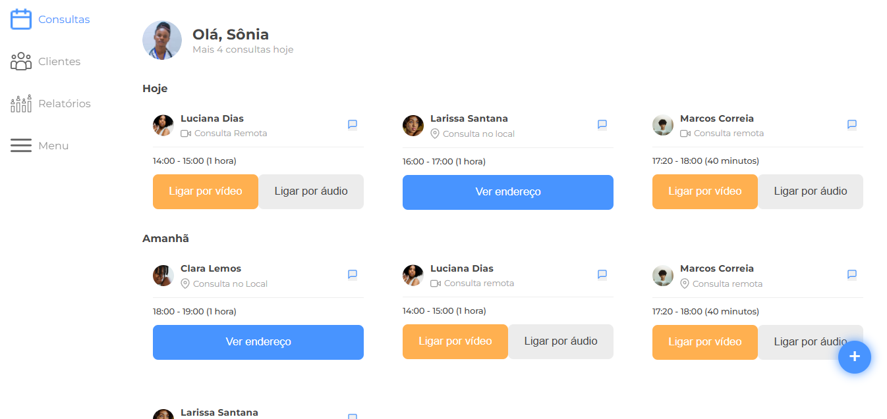
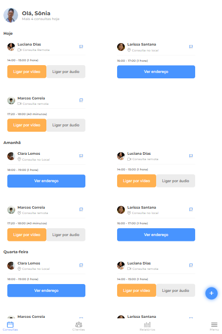
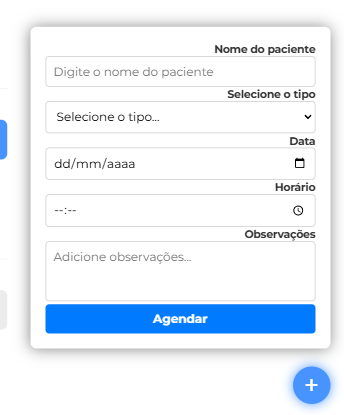
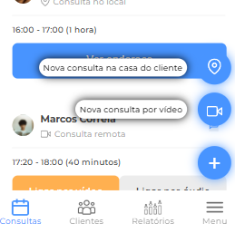

# 7 Days of Code - Site Responsivo para Consultas Médicas

Este repositório contém o projeto desenvolvido durante o desafio **7 Days of Code** promovido pela Alura. O objetivo foi criar um site 100% responsivo para consultas médicas, utilizando **HTML**, **CSS** e **JavaScript**. Este projeto foca em boas práticas de desenvolvimento e acessibilidade, além de proporcionar uma experiência agradável para o usuário em qualquer dispositivo.

## 💻 Tecnologias Utilizadas

- **HTML5**: Para estruturação semântica do site.
- **CSS3**: Para estilização e responsividade.
- **JavaScript**: Para interatividade e comportamento dinâmico.

## 🌟 Funcionalidades

- Design 100% responsivo, adaptável a diferentes tamanhos de tela.
- Layout moderno e acessível, com foco na experiência do usuário.
- Integração de elementos interativos, como menus e formulários.
- Otimização para dispositivos móveis.

## 📂 Estrutura do Projeto

```plaintext
/
├── index.html        # Página principal do site
├── css/
│   ├── main.css            # Estilos globais
│   └── media-queries.css   # Regras específicas para diferentes dispositivos
├── js/
│   └── script.js     # Arquivo JavaScript para interatividade
└── images/               # Imagens globais
    ├── botao_cadastro/   # Ícones do botão mais(+)
    └── barra_inferior/   # Ícones da barra inferior
```

## 🖼️ Galeria de Imagens

| **Desktop** | **Tablet** | **Mobile** |
|-------------|------------|------------|
|  |  |  |


 

## 🚀 Como Executar o Projeto

1. Clone o repositório:
   ```bash
   git clone https://github.com/seuusuario/nome-do-repositorio.git
   ```
2. Navegue até o diretório do projeto:
   ```bash
   cd nome-do-repositorio
   ```
3. Abra o arquivo `index.html` em seu navegador preferido.

## 📌 Desafios e Aprendizados

Durante este projeto, os principais desafios enfrentados foram:

- Implementar um layout responsivo que funciona perfeitamente em diferentes resoluções.
- Garantir a acessibilidade do site.
- Trabalhar com JavaScript para melhorar a interação do usuário.

Aprendizados:

- Utilização de media queries para criar designs responsivos.
- Melhores práticas de organização de código CSS e JavaScript.
- Importância da semântica no HTML para SEO e acessibilidade.

---

### 📣 Sobre o 7 Days of Code

O **7 Days of Code** é uma iniciativa da Alura para incentivar o aprendizado e prática de habilidades de programação. Acesse [aqui](https://7daysofcode.io/) para saber mais.

---

<div align="center">
  Feito com 💙 durante o 7 Days of Code 🚀
</div>
